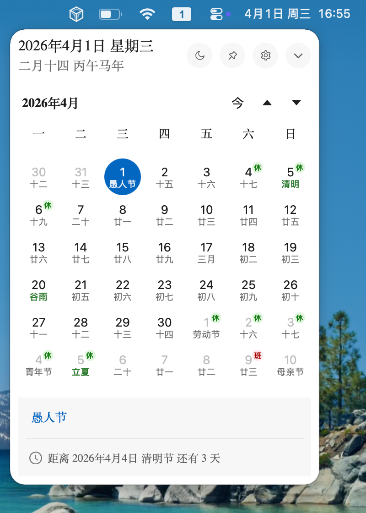

# 松鼠日历

跨平台的桌面日历，支持显示农历、节假日、调休、节气等信息

 

## 主要功能

- 支持 macOS、Windows 等操作系统
- 自定义 Windows 任务栏时钟，可显示**星期**等信息
- 替换 Windows 任务栏的系统日历
- 在 Windows 桌面上显示日历

## 技术栈

- Tauri 2
- React 19
- Ant Design 6
- lunar-typescript

## 开发与构建

```bash
pnpm install
pnpm tauri dev
```

## 本修改版新增

- 月历左侧逐行显示周数（可关闭）。
- 可设置包含 1 月 1 日的第一周从 W0 或 W1 开始编号。
